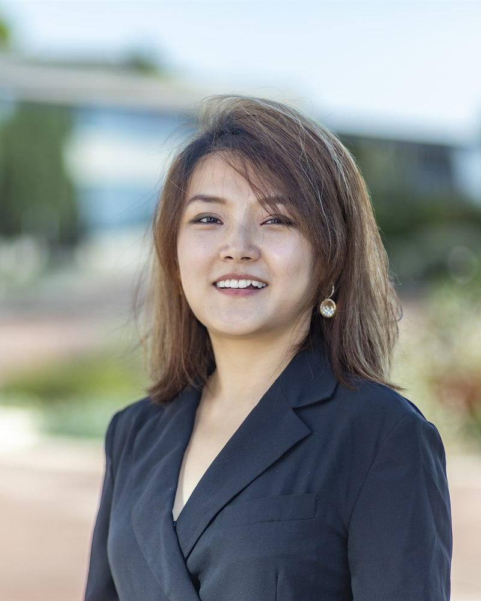

# About

<!--
Profile photo source: docs/assets/images/profile.jpg
Replace that file with a new image using the same filename, or update the image
path below if you prefer a different filename.

Replace the # links for Google Scholar and LinkedIn when those profiles are
ready to share.
-->

<aside class="profile-card" markdown="1">
{ .profile-photo }

## Jiamin Zhao

Ph.D. Candidate in Accounting

IESE Business School

Barcelona, Spain

[JZhao@iese.edu](mailto:JZhao@iese.edu)

[zhao-jiamin.github.io](https://zhao-jiamin.github.io)

[CV](assets/cv.pdf){ .md-button .md-button--primary }
[Email](mailto:JZhao@iese.edu){ .md-button }
[Google Scholar](#){ .md-button }
[LinkedIn](#){ .md-button }

</aside>

<section class="about-copy" markdown="1">

## Hello!

I am a Ph.D. Candidate in Accounting at IESE Business School. My research
examines how firms respond to external stakeholder pressure and how these
responses shape corporate disclosure, labor markets, and information
environments.

My job market paper, "How Does Public Activism Shape Voluntary Disclosure?
Evidence from the Thematic Contents of Conference Calls," studies whether public
activism changes the thematic content of managerial communication in earnings
conference calls. Using textual analysis, I focus on how stakeholder salience,
public scrutiny, and managers' attention to non-financial issues shape voluntary
disclosure.

More broadly, my work studies corporate disclosure, stakeholder pressure, public
activism, textual analysis, capital markets, labor markets, and
sustainability/green finance.

I am especially interested in settings where public information, social pressure,
and firm communication intersect.

</section>

