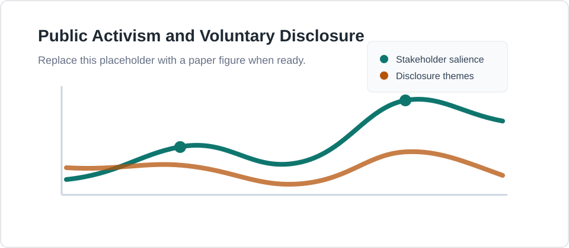

# Research

## Working Papers

Job Market Paper

### How Does Public Activism Shape Voluntary Disclosure? Evidence from the Thematic Contents of Conference Calls

**Coauthors:** Solo-authored. Edit this line if there are coauthors.

[Draft](#){ .md-button .md-button--primary }
[Slides](#){ .md-button }
[Abstract](#job-market-paper-abstract){ .md-button }

{ .paper-figure }

??? abstract "Abstract"
    This paper examines how public activism shapes firms' voluntary disclosure
    choices in conference calls, focusing on stakeholder salience, public
    scrutiny, and the thematic content of managerial communication.

**Presentations:** Add conference, workshop, and seminar presentations here.

**Status:** Draft available soon. Replace the placeholder links above with the
paper draft, slides, or abstract when ready.

### Working Paper Title

**Coauthors:** Add coauthors here, or delete this line.

[Draft](#){ .md-button }
[Slides](#){ .md-button }

??? abstract "Summary"
    Add a short summary of the research question, setting, method, and main
    findings. Keep this concise enough for a quick first read.

**Presentations:** Add presentation venues here.

## Work in Progress

### Project Title

Short description of the idea, setting, and current stage.

### Project Title

Short description of the idea, setting, and current stage.

